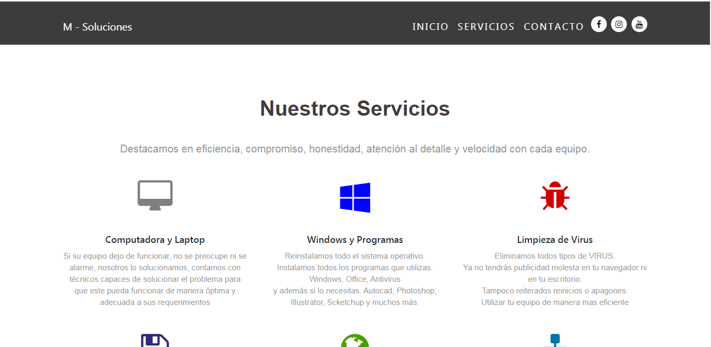

# MSoluciones
Realizada utilizando HTML5, CSS3 y JavaScript mediante el uso de Bootstrapt.
El unico problema de esta aplicación es que el token que se utiliza se tiene que cambiar cada cierto tiempo, porque dejan de andar los datos del API.

## Vistas
 
 
 
 

 

 
 
 
 
 
 
 
  
