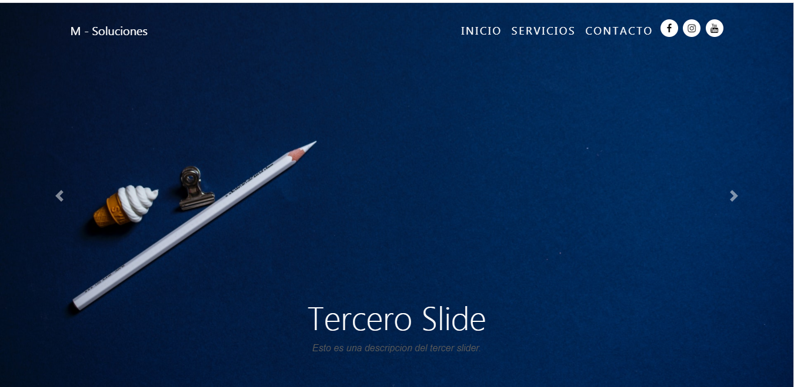

# MSoluciones
Realizada utilizando HTML5, CSS3 y JavaScript mediante el uso de Bootstrapt.
Utilidades:

## Vistas
 #### Tiene un Preload, que mantiene una animacion hasta cargar la web completa.
 
 
  Contiene un Carrousel y Menu con accesos a redes sociales
 

 Utiliza un menu fijo, con funciones de JS.
 

 
 
 
 
 
  Utiliza Animaciones en cada aparicion del contenido
 
  
